<div align="center">


# Bahama

### **The Cloud Toolkit Built for Agents**

Your agent can write the code, but then what? Bahama gives agents a safe, reliable way to manage cloud services: choose providers, provision resources, wire everything together, test locally, and deploy to the web.

Works across Claude Code, Codex, Cursor, and all major coding agents — and with provider accounts you already have (Vercel, Neon, etc.) or directly on the managed [Bahama Cloud](https://www.bahama.ai).



</div>

## Why Bahama?

Coding agents can write entire applications... but stall trying to get them online. They don't know each provider's unique quirks or how to make them work together, so they hand the hard parts back to you: _log into the dashboard, create a database, paste me the connection string_. **You end up working for your agent.**

Bahama flips that. It teaches agents to operate cloud resources with three objectives:

1. **Give agents a structured way to manage cloud services**: choose providers, provision DBs and storage, handle connection strings, run deployments, and more. It makes agents as good at deploying code as they are at writing it.

2. **Create an open standard that works across providers**. No lock-in to one web host. Bahama is built from blocks that you and your agent can compose to best fit the project. Cloudflare + Mongo? Vercel + Supabase + S3? All-in-one Bahama Cloud? They all work the same with `bahama deploy`.

3. **Keep users in control**. Agents do the work, but you always authenticate your cloud accounts manually and approve consequential decisions. Sensitive API keys and connection strings are handled securely.

## Quickstart

> **Alpha** — Bahama is in active development. Commands and provider contracts may change before v0.1.

Bahama is built to be used by agents. To get started, just prompt your coding agent (Claude Code, Codex, etc.):

```text
Read https://bahama.ai/install.md and install Bahama for this workspace.
```

Or install both pieces manually:

```bash
npx -y skills add bahamaAI/bahama --skill bahama --yes
```

```bash
npm install -g bahama
```

The skill teaches your agent how to use Bahama. The CLI safely orchestrates the magic. From there, just ask your AI for outcomes and mention Bahama:

> Let's build a snake game. I want a DB to save high scores. When it's ready, put it on the web with Bahama so I can share it with my friends.

## How it works

Nine commands cover the whole lifecycle — and they work the same on every provider. Most of the time your agent runs these commands behind the scenes. You work with the agent to define the best plan, you approve, and your app is live.

| Command                             | What it does                                                     |
| :---------------------------------- | :--------------------------------------------------------------- |
| `bahama inspect`                    | What is this app? Framework, scripts, env var names — no secrets |
| `bahama providers`                  | What's available? Each provider describes its own capabilities   |
| `bahama init`                       | Write a starter `bahama.yaml` — touches nothing remote           |
| `bahama plan`                       | Compile intent into a reviewable plan — always read-only         |
| `bahama apply <plan-id> --approved` | Execute the plan, verifying every step                           |
| `bahama deploy [environment]`       | Ship the application                                             |
| `bahama status`                     | Compare committed state with live provider state                 |
| `bahama doctor`                     | Check that everything is set up                                  |
| `bahama auth login <provider>`      | Link your own accounts with third-party providers                |

Bahama's orchestration is managed through the following files in your repo. Plans only run after your approval, every step is verified against live provider state, and secrets are sealed end-to-end and/or stored in a local `.env` file.

| File          | Owner                  | Committed | Purpose                                                  |
| :------------ | :--------------------- | :-------- | :------------------------------------------------------- |
| `bahama.yaml` | you and your agent     | yes       | Desired providers, environments, resources, and bindings |
| `bahama.lock` | Bahama                 | yes       | Resolved durable identities and applied binding edges    |
| `.bahama/`    | Bahama                 | no        | Immutable plans, operation receipts, and operation locks |
| Credentials   | provider / Bahama auth | never     | Sessions and tokens in protected credential stores       |

## Many providers, one standard

Bahama is designed to be an **open** standard. It works with a variety of cloud services that you can snap together as needed. Each provider (web host, database service, storage bucket...) declares what it _produces_ and _consumes_ — a database produces `connectionUrl`, an environment consumes `variables` — and Bahama wires compatible outputs to inputs. Swap any block for another that fills the same role.

Your agent defines the whole stack in one standard `bahama.yaml` file at the root of your project. Bahama can interpret, plan, and deploy around it:

```yaml
version: 1

project:
  name: community-notes

application:
  framework: nextjs

environments:
  local:
    provider: local
  production:
    provider: vercel

resources:
  database:
    provider: neon
    engine: postgres

bindings:
  DATABASE_URL:
    from: resources.database.connectionUrl
    to:
      - environments.local.variables
      - environments.production.variables
```

### Current providers

[Bahama Cloud](https://www.bahama.ai) is the first-party cloud service behind this project. It is designed to be a fast, stable, streamlined way to get most projects live in minutes. Bahama also supports a growing list of third-party providers. You provide the account, Bahama provides the orchestration:

| Provider         | ID             | What it manages                                                              |
| :--------------- | :------------- | :--------------------------------------------------------------------------- |
| **Bahama Cloud** | `bahama-cloud` | Managed hosting for static sites, full-stack React apps, and SQL databases   |
| **Vercel**       | `vercel`       | Next.js, Vite, and static applications in your own Vercel account            |
| **Neon**         | `neon`         | Serverless Postgres in your own Neon account, plus checked-in SQL migrations |
| **Local**        | `local`        | Protected local env-file bindings so `npm run dev` just works                |

The ID is the name your agent uses in `bahama.yaml` — `provider: neon`, `provider: vercel`.

## Included in this repository

This monorepo includes everything needed to run Bahama — the agent skill, CLI, core engine, and all the provider contracts. The CLI ([`bahama`](https://www.npmjs.com/package/bahama)) bundles the entire toolkit into one npm package.

Note: [`bahama-runtime`](https://www.npmjs.com/package/bahama-runtime) is an additional package that enables local testing of Bahama Cloud projects.

| Path                                             | Purpose                                                                |
| :----------------------------------------------- | :--------------------------------------------------------------------- |
| [`packages/cli`](packages/cli)                   | The published `bahama` command-line interface                          |
| [`packages/core`](packages/core)                 | Planning, approval, execution, state, verification, and secrets engine |
| [`packages/provider-kit`](packages/provider-kit) | The contract every provider implements                                 |
| [`packages/runtime`](packages/runtime)           | Server-side runtime bridge for Bahama Cloud application resources      |
| [`providers/`](providers)                        | Official provider implementations                                      |
| [`skills/bahama`](skills/bahama)                 | The operating guide installed into a user's coding agent               |

## Contributing

Bug fixes, sharper agent UX, and new provider blocks are all welcome.

You don't need this repository to _use_ Bahama — the npm package ships everything. Clone it to work on Bahama itself (Node.js `20.19+`):

```bash
git clone https://github.com/bahamaAI/bahama.git
cd bahama
npm install
npm run build
npm test
```

Steps for contributing:

1. Read [`AGENTS.md`](AGENTS.md) first — it holds the dependency rules and safety invariants.
2. Keep changes small, and add a regression test for behavior changes.
3. If agent-facing behavior changes, update the provider descriptions and `skills/bahama` too.
4. Run `npm run build && npm test && npm run typecheck && npm run lint` before opening a pull request.

GitHub CI repeats those checks from a clean install on every pull request and
push to `main`, then previews the two public npm packages. Publishing is separate and occurs only from an intentional GitHub Release.

## License

[MIT](LICENSE)
