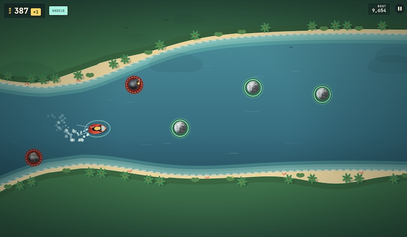

# Reef Runner

Reef Runner is a compact, dependency-free arcade game and the smallest Bahama Cloud example in this repository. It is a plain static site: the game runs entirely in the browser, keeps the best score in local storage, and needs no database or build step.

## Run it locally

Open `index.html` in a browser, then tap, drag, or use the arrow/WASD keys to steer. Reef Runner has no package installation, build command, or local service.

## Deploy it with Bahama

Install the Bahama skill and CLI as described in the [repository quickstart](../../README.md#quickstart), then run:

```bash
bahama inspect
bahama doctor
bahama plan
```

Follow any installation, authentication, or approval instructions returned by the CLI. Apply the reviewed plan using its actual plan ID, then publish the game:

```bash
bahama apply <plan-id> --approved
bahama deploy production
```

The first deployment may return another approval plan; review and apply that plan as directed. Bahama will provision the Bahama Cloud project, upload the static files, and verify the production URL.

This example intentionally starts without `bahama.lock` or `.bahama/`. Bahama creates both during the first real run. Commit the generated lock when this is a real project; keep `.bahama/` local and ignored.
