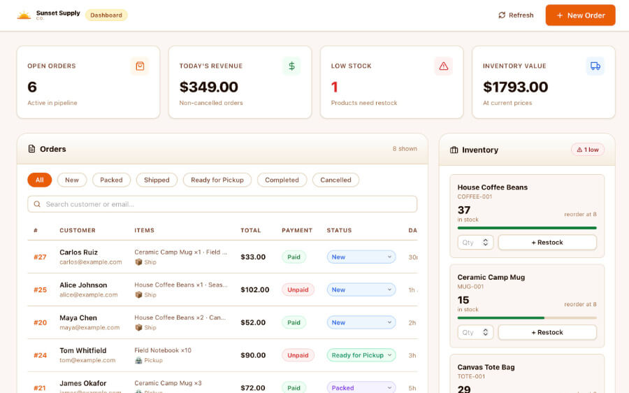

# Example Retail Dashboard (Sunset Supply Co.)

Sunset Supply Co is a moc full-stack company dashboard for demonstrating a composed Bahama deployment. The existing React interface is backed by a Hono API on Vercel and a Neon Postgres database.

It includes a customer order form, inventory tracking, order-status management, dashboard metrics, restocking, and resettable demo data. The dashboard is intentionally public for demonstration purposes; do not put real customer information in it without adding authentication and authorization.

## Architecture

- Vite and React render the dashboard and order flow.
- Hono handles the `/api/*` routes as Vercel Functions.
- Neon stores products, orders, and inventory in Postgres.
- `migrations/0001_create_sunset_supply.sql` creates the schema and starter catalog.
- `bahama.yaml` provisions Neon, configures Vercel, applies the migration, and transfers `DATABASE_URL` to local and production environments without exposing it.

## Prepare the project

Install the application dependencies:

```bash
npm install
```

Install the Bahama skill and CLI as described in the [repository quickstart](../../README.md#quickstart). Then inspect the application and check the selected providers:

```bash
bahama inspect
bahama doctor
bahama plan
```

Follow any installation, account-selection, or authentication instructions returned by Bahama. Review the plan, then apply it using the actual plan ID:

```bash
bahama apply <plan-id> --approved
```

That provisions Neon, applies the checked-in migration, creates or adopts the Vercel project, connects the production database variable, and writes the local `DATABASE_URL` to the ignored `.env.local` file.

## Run locally

After the infrastructure plan succeeds:

```bash
npm run dev
```

Open the URL printed by Vite. On an empty database, use **Load demo orders** to populate the dashboard. The subtle **reset demo** link in the footer restores the same sample data later.

## Deploy

```bash
bahama deploy production
```

The first deployment may return an approval plan. Review and apply it as directed; Bahama will build the Vite frontend, deploy the Hono functions to Vercel, and verify `/api/health`, including its Neon connection.

This example intentionally does not include `bahama.lock` or `.bahama/`. The CLI owns those files. Commit a generated lock for a real deployment and keep `.bahama/` ignored.
